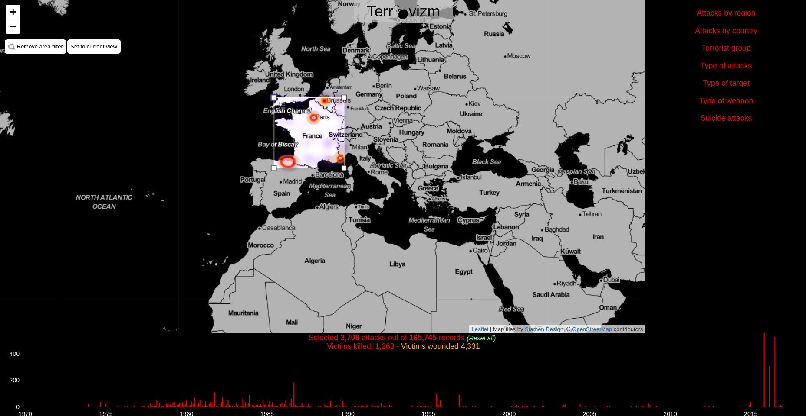
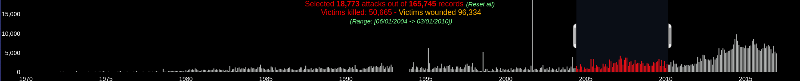
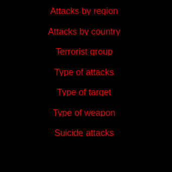

# Terrovizm

This is a project for visualizing the data from the [Global Terrorism Database](http://www.start.umd.edu/gtd/):

> National Consortium for the Study of Terrorism and Responses to Terrorism (START). (2017). Global Terrorism Database [Data file]. Retrieved from https://www.start.umd.edu/gtd

It can be downloaded through the [following form](http://www.start.umd.edu/gtd/contact/), even though a direct link for downloading the data [is available](http://apps.start.umd.edu/gtd/downloads/dataset/GTD_0617dist.zip) but not given publicly.

The [visualization itself is hosted on Github Pages: https://gsurrel.github.io/Terrovizm/](https://gsurrel.github.io/Terrovizm/).

# Peer review

*Notice: Even though we were initially three persons in our group, one left really early in the project and thus only took part in the initial discussions and brainstormings. This project has been brought to life by Doru Muşuroi and Grégoire Surrel.*

During the project, both members were adequately prepared for the meetings, actively contributed to its realization, positively  reviewed the suggested ideas in a conflict-free manner.

# Process book

## Overview, motivation, target audience

Terrorism gets a very unequal mass-media coverage depending on the location of the act itself and how unexpected it is. Some talk about the [death-kilometer score](https://prezi.com/awyxgabj_6c-/the-law-of-death-kilometer-la-loi-du-mort-kilometre/) to explain the media-coverage of each event: the closer and/or more tragic an act is, the more the press talks about it. We believe that having an exhaustive overview of the terrorist acts across the world can really change the perception of terrorism and put it in perspective with its actual prevalence worldwide.

Another key point is the evolution of terrorism. In our ever-more connected life, we hear about any news in a matter of hours or just minutes, thus biasing our perception and giving us the impression that it's a real and rising worldwide threat. Having the ability to see the evolution of terrorist acts since 1970 is interesting as we can see the trends and evolution with respect to the zones of conflicts and influences.

Finally, merging these two aspects can enable anyone to explore the evolution of terrorist acts in specified zones of the world. As the database is feature-rich, we plan to implement additional tools to filer according to the different organizations and motivations.

Therefore, we think the visualization we plan to build is useful both for the general public as well as for journalists because of all the brushing and exploration features available. It can possibly used for political reasons as terrorism is one of the main motivations for governments to adopt and enforce freedom-restrictive laws. Putting the importance of terrorist acts into perspective can change the public's point of view.

## Intended usage

As we are targeting a broad audience, we have to create a visualization which is simple and intuitive to use. That is to say, it should quickly react to user interactions, to give a good feedback. It is also necessary that features provided are discoverable and easy to use. One approach for that can be a tutorial, but it has the drawback to get in the user's way, so the interface should encourage the user to play with the provided tools.

## Related work and inspiration

### Related work

Even though the database is somewhat freely available and the topic is getting a lot of attention, there are surprisingly little visualizations of it. It is mainly image files provided by the database maintainers or a single individual's production:

- [Heatmap of terror acts made by the dataset provider](https://www.start.umd.edu/gtd/images/START_GlobalTerrorismDatabase_TerroristAttacksConcentrationIntensityMap_45Years.png)
- [Hig-res world map of all terrorism events between 1970-2016 (/r/dataisbeautiful)](https://www.reddit.com/r/dataisbeautiful/comments/533ieu/higres_world_map_of_all_terrorism_events_between/)

### Inspiration

Given the Data Visualization course, we discovered many different ways to represent and interact with the data. Our dataset is rather simple, as the main information is geolocated terror acts with a time information, which corresponds to our interests. It is possible to imagine different usage of the database (such as a chord diagram linking terrorist groups and weapon types), but even though it may provide interesting information, it is not what we expect our audience to look for.

Here is a list of tools with inspiring features:

- [Live tweet map](https://www.mapd.com/demos/tweetmap/)
- [Hexagon clustering (for the map, though example unrelated to map)](https://bl.ocks.org/mbostock/4248145)
- [Hexagon clustering, another](http://bl.ocks.org/nbremer/6052814)
- [Facetting and filtering](http://www.cs.umd.edu/~bederson/papers/index.html)
- [Crossfilter the data](https://crossfilter.github.io/crossfilter/)
- [Winds map, show at low zoom, shows specific data-dependent markers at high zoom](http://windhistory.com/map.html)

After sharing the latest versions of the tool (2017-12-17) with a few selected individuals for getting user feedback, one mentioned the [UCDP visualization](http://ucdp.uu.se/#/exploratory), for their Conflict Data Program, which shows violence-related data. The database is different but there is a significant overlap as the big picture is similar. As for the visualization itself, it uses a very similar approach with a map with piecharts aggregating the data (victims) beneath as clusters, with a timeline enabling the user to filter the data accordingly.

## Questions

*What am I trying to show this my visualization?*

We are thinking about a web page with a map as the main element, some toolboxes on the right-hand side and a timeline on the bottom. Here are the functionalities we are currently thinking about:

- Main view: a map displaying each terrorist act as a clickable dot (displaying more info about this specific act), according to the data brushed. It can also be used to brush data for geographic zone restriction.

- Bottom: a timeline showing the number of terrorist acts. It can be collapsed according to the main categories of motivation (independence, religion, etc). It supports brushing too. Category can be enabled or disabled.

- Right panels: horizontal histograms ranking (according to the brushed data) the perpetrators, targets, etc. Each can be enabled or disabled as they are actually facets.

## Dataset

### Description

The Global Terrorism Database is an open-source database including information on terrorist events around the world from 1970 through 2016. The GTD includes systematic data on domestic as well as international terrorist incidents that have occurred during this time period and now includes more than 170,000 cases. The criterions about inclusion in the database are the following:

> **GTD Definition of Terrorism and Inclusion Criteria**, quoted from the GTD Codebook document:
>
> The GTD defines a terrorist attack as the threatened or actual use of illegal force and violence by a non-state actor to attain a political, economic, religious, or social goal through fear, coercion, or intimidation. In practice this means in order to consider an incident for inclusion in the GTD, all three of the following attributes must be present:
>
> - *The incident must be intentional* - the result of a conscious calculation on the part of a perpetrator.
> - *The incident must entail some level of violence or immediate threat of violence* - including property violence, as well as violence against people.
> - *The perpetrators of the incidents must be sub-national actors.* The database does not include acts of state terrorism.
>
> In addition, at least two of the following three criteria must be present for an incident to be included in the GTD:
>
> - *Criterion 1: The act must be aimed at attaining a political, economic, religious, or social goal.* In terms of economic goals, the exclusive pursuit of profit does not satisfy this criterion. It must involve the pursuit of more profound, systemic economic change.
> - *Criterion 2: There must be evidence of an intention to coerce, intimidate, or convey some other message to a larger audience (or audiences) than the immediate victims.* It is the act taken as a totality that is considered, irrespective if every individual involved in carrying out the act was aware of this intention. As long as any of the planners or decision-makers behind the attack intended to coerce, intimidate or publicize, the intentionality criterion is met.
> - *Criterion 3: The action must be outside the context of legitimate warfare activities.* That is, the act must be outside the parameters permitted by international humanitarian law (particularly the prohibition against deliberately targeting civilians or non-combatants).

The database contains several different fields. [Here is for example a single event, showing most of the fields in the database](http://www.start.umd.edu/gtd/search/IncidentSummary.aspx?gtdid=201607140001). Basically, the database contains date/time, location, actor, target, casualties, victims, sources, etc. See the [Codebook, starting from page 12](Codebook.pdf#page=12), for more details. We plan to remove the data we do not plan to use to lighten the dataset to load in the client's browser.

### Processing

The database contains may dimensions and therefore the exhaustive description of all field we discard or not takes a lot of space. It has been reported to the end of this process book.

## Exploratory data analysis

*What viz have you used to gain insights on the data?*

First, it's a hand-made database (with tool assistance), so we wanted to have an overview of the data itself, without having to read all the fields over 170k entries. To do so, we used OpenRefine:

It's possible to have a general idea of the contents by creating facets over the different fields. The results are the following (we excluded the "free text input" fields such as description and summary, as they cannot be grouped anyhow in a useful way for the final vizualization):

 

This confirms that the database seems usable, especially when using the *categorical* fields, that is to say the ones using a number (integer) to assign the category of the column. This is opposed to the free-text fields such as even description, because even it can be grouped, any typing mistake breaks the clustering. As we did not plan to use these free-text fields in the first place, it is not so important for us to clean this specific part of the dataset.

## Designs

*What are the different visualizations you considered? Justify the design decisions you made using the perceptual and design principles.*

### Design worksheets

We used the provided design worksheets to give a structure to the initial idea, refining it according to the available data, the target audience and the information we want to show.

### Selected approach

The following first blueprint show an initial idea for showing the data:

- Main view: a map displaying each act as a (clickable to open more info?) dot, according to the data filtered. It can also be used to brush data.
- Bottom: a timeline showing the number of terrorist acts. It can be collapsed according to the main categories of motivation (independence, religion, etc). It supports brushing. Each category can be enabled or disabled?
- Right panels: horizontal histograms ranking, according to the filtered data, the perpetrators, targets, etc. Each can be enabled or disabled according to the filters.
- Top-left button: resets all filters (as a failsafe feature if the discoverability is poor)

## Did you deviate from your initial proposal?

If the database contents were poor (sparse data in time and place), the visualization would not be useful in any way, hence requiring to change the initial concept. As the database is satisfying, we did not need to change from the initial proposal.

## Implementation

*Describe the intent and functionality of the interactive visualizations you implemented. Provide clear and well-referenced images showing the key design and interaction elements.*

More data exploration oriented, our data visualization has a rich set of interaction elements which allow the user to apply various data manipulation operation in order to get the desired view.

Our visualization makes great use of the geolocation dimension of the database, hence it is based on a map.

### Map view
There are a few design and interaction elements we employed so that our map conveys meaningful information:

1. **Heatmap layer** - aggregates the data in a global view make it easy for the user to make a sense of increased activity regions.

2. **Markers** - in our visualization there are two types of markers:

   * **Event markers**

   

   They have the functionality of summarizing the date in a quick fashion when clicking on them. They are used to give a sense of place on the map, but as there was more information to add to them, we made of area to express the gravity of the event encoded in the number of victims. As there are two type of victims (wounded and killed) we had to make a distinction between them and, as there were only two categories, we used in-place pie-charts to present the ratio between them, while its size is related to the total number of victims. Here we also chose the proper channel for transmitting this type of information: red border for killed victims and dark orange for wounded. It's blue otherwise.

   * **Group markers**

   

   Their creation followed the same principles as the ones for event markers, the difference is that they work on a cluster scale. On click, the map zooms on the markers contained in the cluster.

3. **Zooming** was highly needed for a suitable exploration. While the global map conveys useful information, a lot of times the point of interest is at another scale, as for example country scale. Hence, having good zooming features which reveals more detailed information with higher zoom was a requirement from the beginning. And we manage to get it as we can see below.

   

4. **Brushing** on the map is definitely a great element of our visualization. As we provide statistical information about our terrorist attacks like the victims distribution over time, over the terrorist group that claimed the attacks, over the type of attack, target or weapon, the brushing functionality made it possible to examine these statistics with focus only over a certain region, as presented below

   

### Statistical interaction elements

Our desire was to make use of the data as best as possible. This meant exploiting the time dimension of our dataset as well as the categorical variables recorded by it. This resulted in a wide class of filters that can be triggered in order to gain in-depth insight into the database. We created two different types of faceting:

1. **Time faceting** - the time-range selector in the lower part of our visualization makes the interaction with the data not only location based as we described it up until now, but also period wise. Here we also choose and aggregated view where each bar represents the number of victims per month. This is both for a nicer visual impact and an user-experience.

The selector allows to choose an arbitrary long range so that the user can set his preferred time range with the unit of measure being the month. Also, once fixed this time-range it can be moved around to check the differences between periods taking into consideration the same time-range. The filter is propagated to the data on the map and also on the bar-plots on the right about which we will talk now.

2. **Categorical data filtering**
   We kept seven categorical variables from our database that can be seen below:
   
   Each of these elements are clickable and they unstack into a row plot.
   
   The unstacked row-plow allows for user interaction by making it possible to select one row and then the entire only the attacks with the respective attribute will be presented by our visualization
   

## Technical setup

### Data wrangling - The battle for size

The data provided by the Global Terrorism Database, as described above, contains a lot of information that goes beyond the scope of our visualization so we have to do some preprocessing. The challenge we encounter is that the original data is *xlsx* format and in order to easily work with it JavaScript, we want it to be in JSON format. This raises a size issue: as the initial file has a considerable 82.9MB amount of compressed data, when serializing the dimension would increase to more than double. This has driven us to make the following decisions:

1. We aggregate the columns expressing multiple values of the same attribute, like attacktype1, attacktype2, attacktype3 into a single array for each attribute,
2. We map the categorical variables in our database to integer values in order to save space. These are the columns with `_txt` suffix. They are specified in the columns analysis in appendix by the **as ref** value in the **keep** column,
3. We keep only the columns that are marked with a certain yes. This assures a drastic size decrease while we keep only the necessary information for the visualization,
4. Given that a big part of our project relies on the geo-location dimension of the database, we drop the attacks that do not have the latitude and longitude specified. This is analyzed and motivated more in the jupyter notebook DataCleaning.ipynb,
5. In order to reduce the size of the JSON object sent to client, we serialize the terrorist events to a specially formatted JSON format in the following way:
    * we create a mapping from the column position to column name
    * we keep the events data as rows in a matrix where each column number can be correlated to a column name through the above mentioned mapping
6. We serializa the data to a special formatted JSON with 2 main fields:
    * refs - containing the mapping of the text values as specified above
    * events - containing an array of arrays, described at point 4.

The final JSON file is 18.01 MB big, which is not acceptable to transfer over the network. It turns out that, because we are transferring plain-text with a redundant structure, it compresses really well. With a static web server with GZIP compression, the amount of data actually transferred is 3.77 MB, which is acceptable. This is the measurements taken from the browser's network inspector:

### The battle for speed

#### Markers clustering

Multiple strategies have been applied to have a responsive map. Overall, we have more than 160k events, and the Leaflet map becomes really slow when having about 5k markers displayed. Even if it were usable, the map would be cluttered of many markers, thus loosing the relevant data in the noise.

Clustering the markers geographically dramatically improves the responsiveness of the visualization. The plugin we use has the added benefit that it supports functions handles for icons (both clustered and individual). This means that only the icons to be displayed are generated and allocated in memory. All the others stay as a function handle before they actually get used.

#### Heatmap generation

Even though clustering the markers together under an aggregated piechart, the global overview is not pleasant. At a low zoom level (seeing continents), we lack the granularity of a pixel-based map. We therefore chose to have a heatmap underlay of victims. To have a better view of it, the markers are disabled until the user zooms-in to a smaller area.

Despite the existing documentation, it soon becomes obvious that we will have to tweak the library used to achieve our needs. The biggest problem lies in our somewhat complex data structure. We want the heatmap to reflect the aggregation of victims (killed and wounded). Thinking with D3's mindset, the library has been edited to use a function handle to the data structure rather than data itself for computing the heatmap.

It also required to accept real-time updates from user filters, so it updates itself according to the user's interactions.

#### Faceting and brushing

##### Finding a viable solution

Having around 165k entries in our dataset, we had to find an approach for filtering that would scale to such extent. Knowing exactly the details, it was easy to find a solution for our problem: **Crossfilter** - *a JavaScript library for exploring large multivariate datasets in the browser that supports extremely fast (<30ms) interaction with coordinated views, even with datasets containing a million or more records*. This was exactly what we needed. Moreover, we manage to find a library that would fit our requirements and use both *d3.js* and *crossfilter*, this being **dc.js**.

##### Making the solution work

Using the *dc.js* proved to be a great implementation choice as it provided ready to use and adjustable functionalities for barcharts and time faceting. Incrementally working on our visualization, we observed that *dc.js* by using the *crossfilter* in the underlying implementation scaled rather well for the barplots, making the filtering by the categorical variables fast and the user experience was enjoyable.

The entire experience changed when we implemented the time faceting as it turned out to be a real bottleneck for reaching interactive framerates: filtering by a timerange now took over 2 seconds. This lowered the usage quality of our visualization so a solution was needed with an outmost importance.

We noticed that the timefaceting was implemented as a barchart over which brushing functionality was added. This made us analyze how the data was mapped to a bar and basically only the events with exactly the same time where clustered together. After consulting with the TA - Volodymyr Miz, he guided us towards clustering the events by months in the barchart. This was indeed a good approach as it is now implemented and successfully solves our problem.

#### Web workers

The usage performance is great given the dataset and constraints of updating everything accordingly, but the loading is really slow. Some parts can be offloaded to a webworker (downloading and partial data reshaping). It has the main benefit of not blocking the browser in that time. It that the drawback of increased delay because of the communication between the main thread and the web worker. Another limitation is the fact that it cannot affect the DOM in any way and libraries relying on that cannot be used. For example, Leaflet will not be able to create a map marker in a web worker, even if it is not added to the map.

The main bottleneck is the dimension creation from Crossfilter, mainly on the fields based on text. An initial speedup solution is to parallelize the creation of all the dimensions in individual web workers, but the crossfilter object edits itself when creating each dimension, thus preventing any parallel background work.

### The battle for a shining user experience

As a rule of thumb, it is better not to assume what is good for the user. We ran experiments with multiple users and multiple setups with slight or no knowledge about this project, looking at their behavior while interacting with the visualization. Overall, we made our interface more user-friendly and intuitive, streamlining the data exploration process.

The most problematic points were the following:

1. All the available facets were difficult to discover, mostly because browsers tend to hide the scrollbars. With collapsed facets, it compels the user to interact with all of them, seeing what's important to them,
2. The piecharts conveyed too much information at once, with a combination of multiple dimensions and proportions,
3. Users tend to forget about filters they set. When arriving to a situation where no markers are on the screen or all events are filtered out, we provide a help text to solve the situation,

On the positive aspects, it has been appreciated for how fast and responsive it is and how interesting the project is. They often look for what happened near a place they were (place of birth, residence, holidays travel), or local/national events from the past.

## Evaluation

*What did you learn about the data by using your visualizations? How did you answer your questions? How well does your visualization work, and how could you further improve it?*

# Appendix

## Database contents

### Incident ID and date

| Name | Type | Description | Keep |
|------|------|-------------|------|
| eventid | Number | GTD unique ID of the event | as is |
| iyear | Number | Year | as is |
| imonth | Number | Month. `0` if unknown. | as is |
| iday | Number | Day. `0` if unknown | as is |
| approxdate | **Text** | Approximate date | no |
| extended | Boolean | Whether it happened for more than 24h | no |
| resolution | Date | End date for `extended=1` events. Format DD.MM.YY | no |

### Incident description

| Name | Type | Description | Keep |
|------|------|-------------|------|
| summary | Text | Short "when, where, who, what, how, and why". Systematic after 1997. | no |
| crit1 | Boolean | The incident meets Criterion 1: political, economic, religious, or social goal | ? |
| crit2 | Boolean | The incident meets Criterion 2: intention to coerce, intimidate or publicize to larger audience(s) | ? |
| crit3 | Boolean | The incident meets Criterion 3: outside international humanitarian law | ? |
| doubtterr | Boolean | Doubt as to whether the incident is an act of terrorism (WRT crit1, crit2, crit3). Systematic after 1997, -9 otherwise | ? |
| alternative | Number | Alternative designation category for `doublt=1`. Systematic after 1997 | ? |
| alternative_txt | Text | Alternative designation name for `doublt=1`. Systematic after 1997 | ? |
| multiple | Boolean | Several attacks are connected, but as differents events. Systematic after 1997 | no |
| related | Text | Text reference to `eventid` to connected attacks. Systematic after 1997 | no |

### Indicent location

| Name | Type | Description | Keep |
|------|------|-------------|------|
| country | Number | Country (at time of the event) code where the event happened | as is |
| country_txt | Text | Country (at time of the event) text where the event happened | as ref |
| region | Number | Region code where the event happened | as is |
| region_txt | Text | Region text where the event happened | as ref |
| provstate | Text | First administrative subdivision | no |
| city | Text | City/village/town name. Smallest administrative subdivision if unknown | no |
| vicinity | Boolean | Has the event happened in the vicinity of the city? | no |
| location | Boolean | Additional information about the location | no |
| latitude | Number | Latitude (WGS1984) of the *city* | as is |
| longitude | Number | Longitude (WGS1984) of the *city* | as is |
| specificity | Number | Geospatial resolution of the latitude and longitude fields. **1** = event occurred in city/village/town and lat/long is for that location, **2** = event occurred in city/village/town and no lat/long could be found, so coordinates are for centroid of smallest subnational administrative region identified, **3** = event did not occur in city/village/town, so coordinates are for centroid of smallest subnational administrative region identified, **4** = no 2nd order or smaller region could be identified, so coordinates are for center of 1st order administrative region, **5** = no 1st order administrative region could be identified for the location of the attack, so latitude and longitude are unknown | ? |

### Attack information

| Name | Type | Description | Keep |
|------|------|-------------|------|
| attacktype1 | Number | General method code of attack, from 1 to 9 | as is |
| attacktype1_txt | Text | Attack text: **1** = Assassination, **2** = Hijacking, **3** = Kidnapping, **4** = Barricade Incident, **5** = Bombing/Explosion, **6** = Armed Assault, **7** = Unarmed Assault, **8** =  Facility/Infrastructure Attack, **9** = Unknown | as ref |
| attacktype2 | Number | cf. `attacktype1` | as is |
| attacktype2_txt | Text | cf. `attacktype1_txt` | as ref |
| attacktype3 | Number | cf. `attacktype1` | as is |
| attacktype3_txt | Text | cf. `attacktype1_txt` | as ref |
| success | Boolean | Success of a terrorist strike is defined according to the tangible effects of the attack. Success is not judged in terms of the larger goals of the perpetrators | ? |
| suicide | Boolean | The perpetrator did not intend to escape from the attack alive | as is |

### Weapon information

| Name | Type | Description | Keep |
|------|------|-------------|------|
| weaptype1 | Number | General weapon code, from 1 to 13 | as is |
| weaptype1_txt | Text | Weapon text: **1** = Biological, **2** = Chemical, **3** = Radiological, **4** = Nuclear, **5** = Firearms, **6** = Explosives/Bombs/Dynamite, **7** = Fake Weapons, **8** = Incendiary, **9** = Melee, **10** = Vehicle, **11** = Sabotage Equipment, **12** = Other, **13** = Unknown | as ref |
| weapsubtype1 | Number | More specific weapon code, changing depending on the `weapontype` | no? |
| weapsubtype1_txt | Text | Subweapon text | no? |
| weaptype2 | Number | cf. `weaptype1` | as is |
| weaptype2_txt | Text | cf. `weaptype1_txt` | as ref |
| weapsubtype2 | Text | cf. `weapsubtype1` | no? |
| weapsubtype2_txt | Text | cf. `weapsubtype1_txt` | no? |
| weaptype3 | Number | cf. `weaptype1` | as is |
| weaptype3_txt | Text | cf. `weaptype1_txt` | as ref |
| weapsubtype3 | Text | cf. `weapsubtype1` | no? |
| weapsubtype3_txt | Text | cf. `weapsubtype1_txt` | no? |
| weaptype4 | Number | cf. `weaptype1` | as is |
| weaptype4_txt | Text | cf. `weaptype1_txt` | as ref |
| weapsubtype4 | Text | cf. `weapsubtype1` | no? |
| weapsubtype4_txt | Text | cf. `weapsubtype1_txt` | no? |
| weapdetail | Text | Information on the type of weapon, novel usage, origin, etc. | no |

### Target/Victim Information

| Name | Type | Description | Keep |
|------|------|-------------|------|
| targtype1 | Number | Target code, from 1 to 22 | as is |
| targtype1_txt | Text | Target text: **1** = Business, **2** = Government (general), **3** = Police, **4** = Military, **5** = Aborption related, **6** = Airports/aircrafts, **7** = Government (diplomatic), **8** = Educational institutions, **9** = Food or water supply, **10** = Journalists or media, **11** = Maritime, **12** = NGOs, **13** = Other, **14** = Private citizens and property, **15** = Religious figures/institutions, **16** = Telecommunications, **17** = Terrorists/Non-state militas, **18** = Tourists, **19** = Transportation, **20** = Unknown, **21** = Utilities, **22** = Violent political parties | as ref |
| targsubtype1 | Number | More specific target code, changing depending on the `targtype1` | yes? |
| targsubtype1_txt | Text | Subtarget text | yes? |
| corp1 | Text | Name of the corporate entity or government agency that was targeted | no |
| target1 | Text | This is the specific person, building, installation, etc., that was targeted | no |
| natlty1 | Number | Nationality code of the target that was attacked (same codes as for countries) | no |
| natlty1_txt | Text | Nationality text of the target that was attacked (same codes as for countries) | no |
| targtype2 | Number | cf. `targtype1` | as is |
| targtype2_txt | Text | cf. `targtype1_txt` | as ref |
| targsubtype2 | Number | cf. `targsubtype1` | yes? |
| targsubtype2_txt | Text | cf. `targsubtype1_txt` | yes? |
| corp2 | Text | cf. `corp1` | no |
| target2 | Text | cf. `target1` | no |
| natlty2 | Number | cf. `natlty1` | no |
| natlty2_txt | Text | cf. `natlty1_txt` | no |
| targtype3 | Number | cf. `targtype1` | as is |
| targtype3_txt | Text | cf. `targtype1_txt` | as ref |
| targsubtype3 | Number | cf. `targsubtype1` | yes? |
| targsubtype3_txt | Text | cf. `targsubtype1_txt` | yes? |
| corp3 | Text | cf. `corp1` | no |
| target3 | Text | cf. `target1` | no |
| natlty3 | Number | cf. `natlty1` | no |
| natlty3_txt | Text | cf. `natlty1_txt` | no |

### Perpetrator information

| Name | Type | Description | Keep |
|------|------|-------------|------|
| gname | Text | Name of the group that carried out the attack | as is |
| gsubname | Text | Additional qualifiers or details about the name of the group that carried out the attack. This includes but is not limited to the name of the specific faction when available | ? |
| gname2 | Text | cf. `gname` | as is |
| gsubname2 | Text | cf. `gsubname` | ? |
| gname3 | Text | cf. `gname` | as is |
| gsubname3 | Text | cf. `gsubname` | ? |
| guncertain1 | Boolean | Is `1` if act attribution is only suspected | yes? |
| guncertain2 | Boolean | Is `1` if act attribution is only suspected | yes? |
| guncertain3 | Boolean | Is `1` if act attribution is only suspected | yes? |
| individual | Boolean | Is `1` if not linked to an specific group of people. Systematic after 1997 | no |
| nperps | Number | Total number of terrorists participating in the incident. `-99` or `Unknown` when unknown | no |
| nperpcap | Number | Total number of terrorists captured into custody. `-99` or `Unknown` when unknown. Systematic after 1997 | no |
| claimed | Boolean | Whether the responsibility has been claimed for `gname` or not. Systematic after 1997 | yes? |
| claimmode | Number | Claim mode code, from 1 to 10. Systematic after 1997 | no? |
| claimmode_txt | Text | Claim mode text: **1** = Letter, **2** = Call (pre-incident), **3** = Call (post-incident), **4** = E-Mail, **5** = Note left, **6** = Video, **7** = Posted online, **8** = Personal claim, **9** = Other, **10** = Unknown. Systematic after 1997 | no? |
| compclaim | Number | More than one group claimed separate responsibility for the attack. `-9` for no indication, `[null]` if not applicable. Systematic after 1997 | no? |
| claim2 | Boolean | cf. `claimed` | yes? |
| claimmode2 | Number | cf. `claimmode` | no? |
| claim3 | Boolean | cf. `claimed` | yes? |
| claimmode3 | Number | cf. `claimmode` | no? |
| motive | Text | Motive of the attach. Systematic after 1997  | no |

### Casualties and Consequences

| Name | Type | Description | Keep |
|------|------|-------------|------|
| nkill | Number | Total confirmed fatalities for the incident (victims *and* attackers) | as is |
| nkillus | Number | Number of U.S. citizens who died | no |
| nkillter | Number | Number of perpetrators who died | no |
| nwould | Number | Number of confirmed non-fatal injuries to both perpetrators *and* victims | as is |
| nwouldus | Number | Number of confirmed non-fatal injuries to U.S. citizens | no |
| nwoundte | Number | Number of non-fatal injuries to perpetrators | no |
| property | Number | Evidence of property damage. `-9` = Unknown | no |
| propextent | Number | Extent code of property damage, from 1 to 4 | no |
| propextent_txt | Text | Extent text of property damage, **1** = Catastrophic (likely > $1 billion), **2** = Major (likely > $1 million but < $1 billion), **3** = Minor (likely < $1 million), **4** = Unknown | no |
| propvalue | Number | If `property == 1`, exact U.S. dollar amount of direct damages listed | no |
| propcomment | Number | If `property == 1`, description of imprecise damage measures | no |
| ishostkid | Number | Victims were taken as hostages. `-9` = Unknown | ? |
| nhostkid | Number | Total number of hostages or kidnapping victims | ? |
| ishostkidus | Number | US victims were taken as hostages. `-9` = Unknown | no |
| nhostkidus | Number | Total US number of hostages or kidnapping victims | no |
| nhours | Number | Hours of kidnapping. Empty if a matter of days, `-99` if unknown | no |
| ndays | Number | Days of kidnapping. Empty if a matter of hours, `-99` if unknown | no |
| divert | Text | Country that kidnappers/hijackers diverted to | no |
| kidhijcountry | Text | Country of kidnapping/hijacking resolution | no |
| ransom | Number | Whether there was a ransom demanded. `-9` for unknown, `[NULL]` if not applicable | no? |
| ransomamt | Number | Amount (in U.S. dollars) of the ransom | no? |
| ransomus | Number | Whether there was a ransom demanded from US source. `-9` for unknown | no |
| ransomamtus | Number | Amount (in U.S. dollars) of the ransom from US source | no |
| ransompaid | Number | Ransom amount paid. `-99` for unknown | no |
| ransomnote | Text | Additional details relating to a ransom. Systematic after 1997 | no |
| hostkidoutcome | Number | Kidnapping/Hostage outcome code, from 1 to 7 | no |
| hostkidoutcome_txt | Text | Kidnapping/Hostage outcome text, **1** = attempted rescue, **2** = hostages released, **3** = hostages escaped, **4** = hostages killed, **5** = successful rescue, **6** = Combination, **7** = unknown | no |
| nreleased | Number | Number released/escaped/rescued, `-99` if unknown | no |

### Additional Information and Sources

| Name | Type | Description | Keep |
|------|------|-------------|------|
| addnotes | Text | Additional relevant details about the attack. Systematic after 1997 | no |
| INT_LOG | Number | Whether a perpetrator group crossed a border to carry out an attack. `-9` for unknown | no |
| INT_IDEO | Number | Whether a perpetrator group attacked a target of a different nationality. `-9` for unknown | no |
| INT_MISC | Number | Whether a perpetrator group attacked a target of a different nationality. Does not require information about the nationality of the perpetrator group. `-9` for unknown | no |
| INT_ANY | Number | Any of `INT_LOG`, `INT_IDEO`, or `INT_MISC`. `-9` for unknown | no |
| scite1 | Text | First source that was used to compile information on the specific incident | no |
| scite2 | Text | Second source that was used to compile information on the specific incident | no |
| scite3 | Text | Third source that was used to compile information on the specific incident | no |
| dbsource | Text | Identifies the original data collection effort in which each event was recorded | no |
