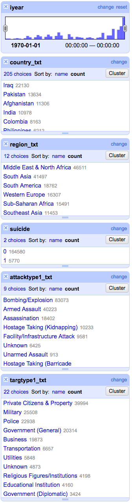
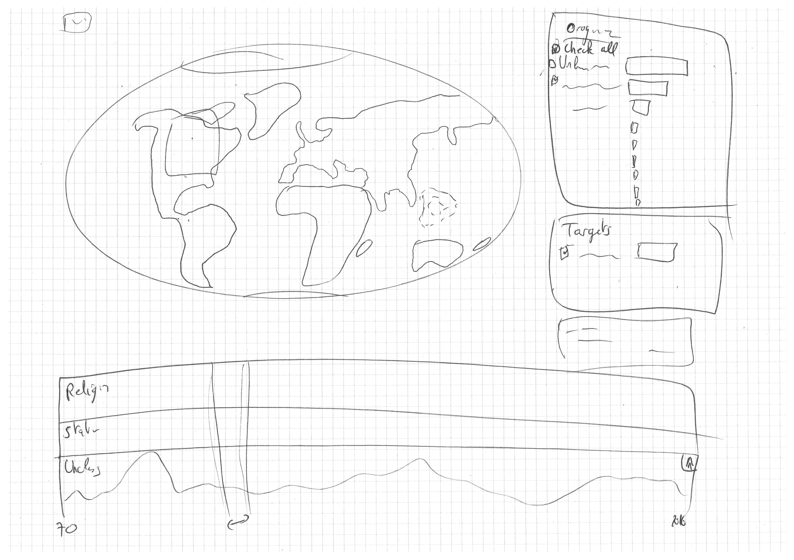

# Terrovizm

This is a project for visualizing the data from the [Global Terrorism Database](http://www.start.umd.edu/gtd/):

> National Consortium for the Study of Terrorism and Responses to Terrorism (START). (2017). Global Terrorism Database [Data file]. Retrieved from https://www.start.umd.edu/gtd

It can be downloaded through the [following form](http://www.start.umd.edu/gtd/contact/), even though a direct link for downlaoding the data [is available](http://apps.start.umd.edu/gtd/downloads/dataset/GTD_0617dist.zip) but not given publicly.

The [vizualization itself is hosted on Github Pages](https://gsurrel.github.io/Terrovizm/).

## To do

- [x] Create Github project and pages
- [x] [Register the project](https://docs.google.com/forms/d/e/1FAIpQLSc_boP3m3UtulHvia8WgLoFYemn9yEZmuq4-glNSgGfc3O2pw/viewform)
- [x] Contact the GTD to ask for permission to publicly use the viz or it stays private
- [ ] Check exactly the data available and what we keep for the Viz ([process book link](#dataset))
- [ ] Use the [deisgn worksheets](https://design-worksheets.github.io/) mentionned in the course ([process book link](#designs))
- [ ] Do all the mockups, blueprints and sketching required ([process book link](#designs))
    - [x] Initial sketch done
- [ ] Python scriting to clean and shrink the dataset. Most textual details can probably be removed as we can give just a link to the official GTD event description and details. Scripting has the benefit of maintainability to update our dataset according to the original DB updates. ([process book link](#technical-setup))
- [ ] Use this Readme as a process book?
- [ ] Screencast:
    - Demonstrate what you can do with your viz in a fun, engaging and impactful manner
    - Talk about your main contributions rather than on technical details
    - 2 min video not more (max +5 sec)

## Timeline (assuming Tuesdays)

- 2017-11-14 (Week 9): Proposals (via google form)
- 2017-11-28 (Week 11): Functional project prototype review
- 2017-12-12 (Week 13): Final project with screencast, story telling and peer-evaluations
- 2017-12-19 (Week 14): Project presentations

# Process book

## Overview, motivation, target audience

Terrorism gets a very unequal mass-media coverage depending on the location of the act itself and how unexpected it is. Some talk about the death-kilometer score to explain the media-coverage of each event: the closer and/or more tragic an act is, the more the press talks about it. We believe that having an exhaustive overview of the terrorist acts across the world can really change the perception of terrorism and put it in perspective with its actual prevalence worldwide.

Another key point is the evolution of terrorism. In our ever-more connected life, we hear about any news in a matter of hours or just minutes, thus biasing our perception and giving us the impression that it's a real and rising worldwide threat. Having the ability to see the evolution of terrorist acts since 1970 is interesting as we can see the trends and evolution with respect to the zones of conflicts and influences.

Finally, merging these two aspects can enable anyone to explore the evolution of terrorist acts in specified zones of the world. As the database is feature-rich, we plan to implement additional tools to filer according to the different organizations and motivations.

Therefore, we think the visualization we plan to build is useful both for the general public as well as for journalists because of all the brushing and exploration features available. It can possibly used for political reasons as terrorism is one of the main motivations for governments to adopt and enforce freedom-restrictive laws. Putting the importance of terrorist acts into perspective can change the public's point of view.

## Intented usage

## Related work and inspiration

### Related work

- [Hig-res world map of all terrorism events between 1970-2016 (/r/dataisbeautiful)](https://www.reddit.com/r/dataisbeautiful/comments/533ieu/higres_world_map_of_all_terrorism_events_between/)
- [Heatmap of terror acts made by the dataset provider](https://www.start.umd.edu/gtd/images/START_GlobalTerrorismDatabase_TerroristAttacksConcentrationIntensityMap_45Years.png)

### Inspiration

- https://www.mapd.com/demos/tweetmap/
- [Hexagon clustering (for the map, though example unrelated to map)](https://bl.ocks.org/mbostock/4248145)
- [Hexagon clustering, another](http://bl.ocks.org/nbremer/6052814)
- [Facetting and filtering](http://www.cs.umd.edu/~bederson/papers/index.html)
- [Crossfilter](https://square.github.io/crossfilter/)
- [Winds map, show at low zoom, shows specific data-dependent markers at high zoom](http://windhistory.com/map.html)
- [Transition from individual graphs to stacked ones](https://bl.ocks.org/mbostock/1256572)
- [Collapsable categories](https://bl.ocks.org/mbostock/1093025)

## Questions

*What am I trying to show this my viz?*

We are thinking about a web page with a map as the main element, some toolboxes on the right-hand side and a timeline on the bottom. Here are the functionalities we are currently thinking about:

- Main view: a map displaying each terrorist act as a clickable dot (displaying more info about this specific act), according to the data brushed. It can also be used to brush data for geographic zone restriction.

- Bottom: a timeline showing the number of terrorist acts. It can be collapsed according to the main categories of motivation (independence, religion, etc). It supports brushing too. Category can be enabled or disabled.

- Right panels: horizontal histograms ranking (according to the brushed data) the perpetrators, targets, etc. Each can be enabled or disabled as they are actually facets.

## Dataset

*Where does it come from, what are you processing steps?*

### Description

The Global Terrorism Database is an open-source database including information on terrorist events around the world from 1970 through 2016. The GTD includes systematic data on domestic as well as international terrorist incidents that have occurred during this time period and now includes more than 170,000 cases. The criterions about inclusion in the database are the following:

> **GTD Definition of Terrorism and Inclusion Criteria**, quoted from the GTD Codebook document:
>
> The GTD defines a terrorist attack as the threatened or actual use of illegal force and violence by a non-state actor to attain a political, economic, religious, or social goal through fear, coercion, or intimidation. In practice this means in order to consider an incident for inclusion in the GTD, all three of the following attributes must be present:
>
> - *The incident must be intentional* - the result of a conscious calculation on the part of a perpetrator.
> - *The incident must entail some level of violence or immediate threat of violence* - including property violence, as well as violence against people.
> - *The perpetrators of the incidents must be sub-national actors.* The database does not include acts of state terrorism.
>
> In addition, at least two of the following three criteria must be present for an incident to be included in the GTD:
>
> - *Criterion 1: The act must be aimed at attaining a political, economic, religious, or social goal.* In terms of economic goals, the exclusive pursuit of profit does not satisfy this criterion. It must involve the pursuit of more profound, systemic economic change.
> - *Criterion 2: There must be evidence of an intention to coerce, intimidate, or convey some other message to a larger audience (or audiences) than the immediate victims.* It is the act taken as a totality that is considered, irrespective if every individual involved in carrying out the act was aware of this intention. As long as any of the planners or decision-makers behind the attack intended to coerce, intimidate or publicize, the intentionality criterion is met.
> - *Criterion 3: The action must be outside the context of legitimate warfare activities.* That is, the act must be outside the parameters permitted by international humanitarian law (particularly the prohibition against deliberately targeting civilians or non-combatants).

The database contains several different fields. [Here is for example a single event, showing most of the fields in the database](http://www.start.umd.edu/gtd/search/IncidentSummary.aspx?gtdid=201607140001). Basically, the database contains date/time, location, actor, target, casualties, victims, sources, etc. See the [Codebook, starting from page 12](Codebook.pdf#page=12), for more details. We plan to remove the data we do not plan to use to lighten the dataset to load in the client's browser.

### Processing

#### Incident ID and date

| Name | Type | Description | Keep |
|------|------|-------------|------|
| eventid | Number | GTD unique ID of the event | as is |
| iyear | Number | Year | as is |
| imonth | Number | Month. `0` if unknown. | as is |
| iday | Number | Day. `0` if unknown | as is |
| approxdate | **Text** | Approximate date | no |
| extended | Boolean | Whether it happened for more than 24h | no |
| resolution | Date | End date for `extended=1` events. Format DD.MM.YY | no |

#### Incident description

| Name | Type | Description | Keep |
|------|------|-------------|------|
| summary | Text | Short "when, where, who, what, how, and why". Systematic after 1997. | no |
| crit1 | Boolean | The incident meets Criterion 1: political, economic, religious, or social goal | ? |
| crit2 | Boolean | The incident meets Criterion 2: intention to coerce, intimidate or publicize to larger audience(s) | ? |
| crit3 | Boolean | The incident meets Criterion 3: outside international humanitarian law | ? |
| doubtterr | Boolean | Doubt as to whether the incident is an act of terrorism (WRT crit1, crit2, crit3). Systematic after 1997, -9 otherwise | ? |
| alternative | Number | Alternative designation category for `doublt=1`. Systematic after 1997 | ? |
| alternative_txt | Text | Alternative designation name for `doublt=1`. Systematic after 1997 | ? |
| multiple | Boolean | Several attacks are connected, but as differents events. Systematic after 1997 | no |
| related | Text | Text reference to `eventid` to connected attacks. Systematic after 1997 | no |

#### Indicent location

| Name | Type | Description | Keep |
|------|------|-------------|------|
| country | Number | Country (at time of the event) code where the event happened | as is |
| country_txt | Text | Country (at time of the event) text where the event happened | ref |
| region | Number | Region code where the event happened | as is |
| region_txt | Text | Region text where the event happened | ref |
| provstate | Text | First administrative subdivision | no |
| city | Text | City/village/town name. Smallest administrative subdivision if unknown | no |
| vicinity | Boolean | Has the event happened in the vicinity of the city? | no |
| location | Boolean | Additional information about the location | no |
| latitude | Number | Latitude (WGS1984) of the *city* | as is |
| longitude | Number | Longitude (WGS1984) of the *city* | as is |
| specificity | Number | Geospatial resolution of the latitude and longitude fields. **1** = event occurred in city/village/town and lat/long is for that location, **2** = event occurred in city/village/town and no lat/long could be found, so coordinates are for centroid of smallest subnational administrative region identified, **3** = event did not occur in city/village/town, so coordinates are for centroid of smallest subnational administrative region identified, **4** = no 2nd order or smaller region could be identified, so coordinates are for center of 1st order administrative region, **5** = no 1st order administrative region could be identified for the location of the attack, so latitude and longitude are unknown | ? |

#### Attack information

| Name | Type | Description | Keep |
|------|------|-------------|------|
| attacktype1 | Number | General method code of attack, from 1 to 9 | as is |
| attacktype1_txt | Text | Attack text: **1** = Assassination, **2** = Hijacking, **3** = Kidnapping, **4** = Barricade Incident, **5** = Bombing/Explosion, **6** = Armed Assault, **7** = Unarmed Assault, **8** =  Facility/Infrastructure Attack, **9** = Unknown | ref |
| attacktype2 | Number | cf. `attacktype1` | as is |
| attacktype2_txt | Text | cf. `attacktype1_txt` | ref |
| attacktype3 | Number | cf. `attacktype1` | as is |
| attacktype3_txt | Text | cf. `attacktype1_txt` | ref |
| success | Boolean | Success of a terrorist strike is defined according to the tangible effects of the attack. Success is not judged in terms of the larger goals of the perpetrators | ? |
| suicide | Boolean | The perpetrator did not intend to escape from the attack alive | yes |

#### Weapon information

| Name | Type | Description | Keep |
|------|------|-------------|------|
| weaptype1 | Number | General weapon code, from 1 to 13 | as is |
| weaptype1_txt | Text | Weapon text: **1** = Biological, **2** = Chemical, **3** = Radiological, **4** = Nuclear, **5** = Firearms, **6** = Explosives/Bombs/Dynamite, **7** = Fake Weapons, **8** = Incendiary, **9** = Melee, **10** = Vehicle, **11** = Sabotage Equipment, **12** = Other, **13** = Unknown | ref |
| weapsubtype1 | Number | More specific weapon code, changing depending on the `weapontype` | no? |
| weapsubtype1_txt | Text | Subweapon text | no? |
| weaptype2 | Number | cf. `weaptype1` | as is |
| weaptype2_txt | Text | cf. `weaptype1_txt` | ref |
| weapsubtype2 | Text | cf. `weapsubtype1` | no? |
| weapsubtype2_txt | Text | cf. `weapsubtype1_txt` | no? |
| weaptype3 | Number | cf. `weaptype1` | as is |
| weaptype3_txt | Text | cf. `weaptype1_txt` | ref |
| weapsubtype3 | Text | cf. `weapsubtype1` | no? |
| weapsubtype3_txt | Text | cf. `weapsubtype1_txt` | no? |
| weaptype4 | Number | cf. `weaptype1` | as is |
| weaptype4_txt | Text | cf. `weaptype1_txt` | ref |
| weapsubtype4 | Text | cf. `weapsubtype1` | no? |
| weapsubtype4_txt | Text | cf. `weapsubtype1_txt` | no? |
| weapdetail | Text | Information on the type of weapon, novel usage, origin, etc. | no |

#### Target/Victim Information

| Name | Type | Description | Keep |
|------|------|-------------|------|
| targtype1 | Number | Target code, from 1 to 22 | as is |
| targtype1_txt | Text | Target text: **1** = Business, **2** = Government (general), **3** = Police, **4** = Military, **5** = Aborption related, **6** = Airports/aircrafts, **7** = Government (diplomatic), **8** = Educational institutions, **9** = Food or water supply, **10** = Journalists or media, **11** = Maritime, **12** = NGOs, **13** = Other, **14** = Private citizens and property, **15** = Religious figures/institutions, **16** = Telecommunications, **17** = Terrorists/Non-state militas, **18** = Tourists, **19** = Transportation, **20** = Unknown, **21** = Utilities, **22** = Violent political parties | ref |
| targsubtype1 | Number | More specific target code, changing depending on the `targtype1` | yes? |
| targsubtype1_txt | Text | Subtarget text | yes? |
| corp1 | Text | Name of the corporate entity or government agency that was targeted | no |
| target1 | Text | This is the specific person, building, installation, etc., that was targeted | no |
| natlty1 | Number | Nationality code of the target that was attacked (same codes as for countries) | no |
| natlty1_txt | Text | Nationality text of the target that was attacked (same codes as for countries) | no |
| targtype2 | Number | cf. `targtype1` | as is |
| targtype2_txt | Text | cf. `targtype1_txt` | ref |
| targsubtype2 | Number | cf. `targsubtype1` | yes? |
| targsubtype2_txt | Text | cf. `targsubtype1_txt` | yes? |
| corp2 | Text | cf. `corp1` | no |
| target2 | Text | cf. `target1` | no |
| natlty2 | Number | cf. `natlty1` | no |
| natlty2_txt | Text | cf. `natlty1_txt` | no |
| targtype3 | Number | cf. `targtype1` | as is |
| targtype3_txt | Text | cf. `targtype1_txt` | ref |
| targsubtype3 | Number | cf. `targsubtype1` | yes? |
| targsubtype3_txt | Text | cf. `targsubtype1_txt` | yes? |
| corp3 | Text | cf. `corp1` | no |
| target3 | Text | cf. `target1` | no |
| natlty3 | Number | cf. `natlty1` | no |
| natlty3_txt | Text | cf. `natlty1_txt` | no |

#### Perpetrator information

| Name | Type | Description | Keep |
|------|------|-------------|------|
| gname | Text | Name of the group that carried out the attack | yes |
| gsubname | Text | Additional qualifiers or details about the name of the group that carried out the attack. This includes but is not limited to the name of the specific faction when available | ? |
| gname2 | Text | cf. `gname` | yes |
| gsubname2 | Text | cf. `gsubname` | ? |
| gname3 | Text | cf. `gname` | yes |
| gsubname3 | Text | cf. `gsubname` | ? |
| guncertain1 | Boolean | Is `1` if act attribution is only suspected | yes? |
| guncertain2 | Boolean | Is `1` if act attribution is only suspected | yes? |
| guncertain3 | Boolean | Is `1` if act attribution is only suspected | yes? |
| individual | Boolean | Is `1` if not linked to an specific group of people. Systematic after 1997 | no |
| nperps | Number | Total number of terrorists participating in the incident. `-99` or `Unknown` when unknown | no |
| nperpcap | Number | Total number of terrorists captured into custody. `-99` or `Unknown` when unknown. Systematic after 1997 | no |
| claimed | Boolean | Whether the responsibility has been claimed for `gname` or not. Systematic after 1997 | yes? |
| claimmode | Number | Claim mode code, from 1 to 10. Systematic after 1997 | no? |
| claimmode_txt | Text | Claim mode text: **1** = Letter, **2** = Call (pre-incident), **3** = Call (post-incident), **4** = E-Mail, **5** = Note left, **6** = Video, **7** = Posted online, **8** = Personal claim, **9** = Other, **10** = Unknown. Systematic after 1997 | no? |
| compclaim | Number | More than one group claimed separate responsibility for the attack. `-9` for no indication, `[null]` if not applicable. Systematic after 1997 | no? |
| claim2 | Boolean | cf. `claimed` | yes? |
| claimmode2 | Number | cf. `claimmode` | no? |
| claim3 | Boolean | cf. `claimed` | yes? |
| claimmode3 | Number | cf. `claimmode` | no? |
| claim2 | Number | cf. `claimed` | yes? |

#### Casualties and Consequences

| Name | Type | Description | Keep |
|------|------|-------------|------|
| nkill | Number | Total confirmed fatalities for the incident (victims *and* attackers) | yes |
| nkillus | Number | Number of U.S. citizens who died | no |
| nkillter | Number | Number of perpetrators who died | no |
| nwould | Number | Number of confirmed non-fatal injuries to both perpetrators *and* victims | yes |
| nwouldus | Number | Number of confirmed non-fatal injuries to U.S. citizens | no |
| nwoundte | Number | Number of non-fatal injuries to perpetrators | no |
| property | Number | Evidence of property damage. `-9` = Unknown | no |
| propextent | Number | Extent code of property damage, from 1 to 4 | no |
| propextent_txt | Text | Extent text of property damage, **1** = Catastrophic (likely > $1 billion), **2** = Major (likely > $1 million but < $1 billion), **3** = Minor (likely < $1 million), **4** = Unknown | no |
| propvalue | Number | If `property == 1`, exact U.S. dollar amount of direct damages listed | no |
| propcomment | Number | If `property == 1`, description of imprecise damage measures | no |
| ishostkid | Number | Victims were taken as hostages. `-9` = Unknown | ? |
| nhostkid | Number | Total number of hostages or kidnapping victims | ? |
| ishostkidus | Number | US victims were taken as hostages. `-9` = Unknown | no |
| nhostkidus | Number | Total US number of hostages or kidnapping victims | no |
| nhours | Number | Hours of kidnapping. Empty if a matter of days, `-99` if unknown | no |
| ndays | Number | Days of kidnapping. Empty if a matter of hours, `-99` if unknown | no |
| divert | Text | Country that kidnappers/hijackers diverted to | no |
| kidhijcountry | Text | Country of kidnapping/hijacking resolution | no |
| ransom | Number | Whether there was a ransom demanded. `-9` for unknown, `[NULL]` if not applicable | no? |
| ransomamt | Number | Amount (in U.S. dollars) of the ransom | no? |
| ransomus | Number | Whether there was a ransom demanded from US source. `-9` for unknown | no |
| ransomamtus | Number | Amount (in U.S. dollars) of the ransom from US source | no |
| ransompaid | Number | Ransom amount paid. `-99` for unknown | no |
| ransomnote | Text | Additional details relating to a ransom. Systematic after 1997 | no |
| hostkidoutcome | Number | Kidnapping/Hostage outcome code, from 1 to 7 | no |
| hostkidoutcome_txt | Text | Kidnapping/Hostage outcome text, **1** = attempted rescue, **2** = hostages released, **3** = hostages escaped, **4** = hostages killed, **5** = successful rescue, **6** = Combination, **7** = unknown | no |
| nreleased | Number | Number released/escaped/rescued, `-99` if unknown | no |

#### Additional Information and Sources

| Name | Type | Description | Keep |
|------|------|-------------|------|
| addnotes | Text | Additional relevant details about the attack. Systematic after 1997 | no |
| INT_LOG | Number | Whether a perpetrator group crossed a border to carry out an attack. `-9` for unknown | no |
| INT_IDEO | Number | Whether a perpetrator group attacked a target of a different nationality. `-9` for unknown | no |
| INT_MISC | Number | Whether a perpetrator group attacked a target of a different nationality. Does not require information about the nationality of the perpetrator group. `-9` for unknown | no |
| INT_ANY | Number | Any of `INT_LOG`, `INT_IDEO`, or `INT_MISC`. `-9` for unknown | no |
| scite1 | Text | First source that was used to compile information on the specific incident | no |
| scite2 | Text | Second source that was used to compile information on the specific incident | no |
| scite3 | Text | Third source that was used to compile information on the specific incident | no |
| dbsource | Text | Identifies the original data collection effort in which each event was recorded | no |

## Exploratory data analysis

*What viz have you used to gain insights on the data?*

First, it's a hand-made created database, so we wanted to have an overview of the data itself, without having to read all the fields over 170k entries. To do so, we used OpenRefine:

It's possible to have a general idea of the contents by creating facets over the different fields. The results are the following (we excluded the "free text input" fields such as description and summary, as they cannot be grouped anyhow in a useful way for the final vizualization):

 

## Designs

*What are the different visualizations you considered? Justify the design decisions you made using the perceptual and design principles.*

The following first blueprint show an initial idea for showing the data:

- Main view: a map displaying each act as a (clickable to open more info?) dot, according to the data filtered. It can also be used to brush data.
- Bottom: a timeline showing the number of terrorist acts. It can be collapsed according to the main categories of motivation (independence, religion, etc). It supports brushing. Each category can be enabled or disabled?
- Right panels: horizontal histograms ranking, according to the filtered data, the perpetrators, targets, etc. Each can be enabled or disabled according to the filters.
- Top-left button: resets all filters (as a failsafe feature if the discoverability is poor)

## Did you deviate from your initial proposal?

## Implementation

*Describe the intent and functionality of the interactive visualizations you implemented. Provide clear and well-referenced images showing the key design and interaction elements.*

## Technical setup

## Evaluation

*What did you learn about the data by using your visualizations? How did you answer your questions? How well does your visualization work, and how could you further improve it?*

