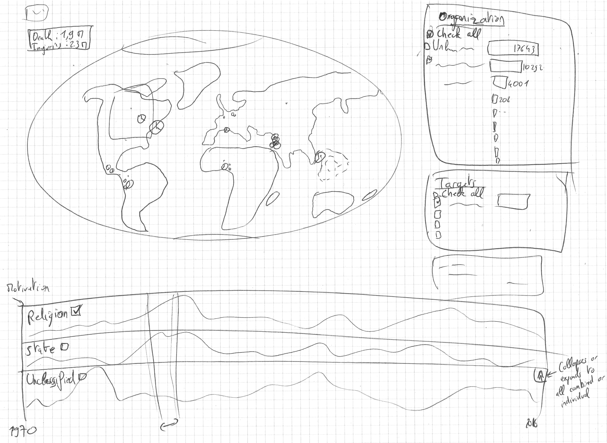

# Terrovizm

This is a project for visualizing the data from the [Global Terrorism Database](http://www.start.umd.edu/gtd/):

> National Consortium for the Study of Terrorism and Responses to Terrorism (START). (2017). Global Terrorism Database [Data file]. Retrieved from https://www.start.umd.edu/gtd

It can be downloaded through the [following form](http://www.start.umd.edu/gtd/contact/), even though a direct link for downlaoding the data [is available](http://apps.start.umd.edu/gtd/downloads/dataset/GTD_0617dist.zip) but not given publicly.

The [vizualization itself is hosted on Github Pages](https://gsurrel.github.io/Terrovizm/).

## To do

- [x] Create Github project and pages
- [x] [Register the project](https://docs.google.com/forms/d/e/1FAIpQLSc_boP3m3UtulHvia8WgLoFYemn9yEZmuq4-glNSgGfc3O2pw/viewform)
- [x] Contact the GTD to ask for permission to publicly use the viz or it stays private
- [ ] Check exactly the data available and what we keep for the Viz ([process book link](#dataset))
- [ ] Use the [deisgn worksheets](https://design-worksheets.github.io/) mentionned in the course ([process book link](#designs))
- [ ] Do all the mockups, blueprints and sketching required ([process book link](#designs))
    - [x] Initial sketch done
- [ ] Python scriting to clean and shrink the dataset. Most textual details can probably be removed as we can give just a link to the official GTD event description and details. Scripting has the benefit of maintainability to update our dataset according to the original DB updates. ([process book link](#technical-setup))
- [ ] Use this Readme as a process book?
- [ ] Screencast:
    - Demonstrate what you can do with your viz in a fun, engaging and impactful manner
    - Talk about your main contributions rather than on technical details
    - 2 min video not more (max +5 sec)

## Timeline (assuming Tuesdays)

- 2017-11-14 (Week 9): Proposals (via google form)
- 2017-11-28 (Week 11): Functional project prototype review
- 2017-12-12 (Week 13): Final project with screencast, story telling and peer-evaluations
- 2017-12-19 (Week 14): Project presentations

# Process book

## Overview, motivation, target audience

Terrorism gets a very unequal mass-media coverage depending on the location of the act itself and how unexpected it is. Some talk about the death-kilometer score to explain the media-coverage of each event: the closer and/or more tragic an act is, the more the press talks about it. We believe that having an exhaustive overview of the terrorist acts across the world can really change the perception of terrorism and put it in perspective with its actual prevalence worldwide.

Another key point is the evolution of terrorism. In our ever-more connected life, we hear about any news in a matter of hours or just minutes, thus biasing our perception and giving us the impression that it's a real and rising worldwide threat. Having the ability to see the evolution of terrorist acts since 1970 is interesting as we can see the trends and evolution with respect to the zones of conflicts and influences.

Finally, merging these two aspects can enable anyone to explore the evolution of terrorist acts in specified zones of the world. As the database is feature-rich, we plan to implement additional tools to filer according to the different organizations and motivations.

Therefore, we think the visualization we plan to build is useful both for the general public as well as for journalists because of all the brushing and exploration features available. It can possibly used for political reasons as terrorism is one of the main motivations for governments to adopt and enforce freedom-restrictive laws. Putting the importance of terrorist acts into perspective can change the public's point of view.

## Intented usage

## Related work and inspiration

### Related work

- [Hig-res world map of all terrorism events between 1970-2016 (/r/dataisbeautiful)](https://www.reddit.com/r/dataisbeautiful/comments/533ieu/higres_world_map_of_all_terrorism_events_between/)
- [Heatmap of terror acts made by the dataset provider](https://www.start.umd.edu/gtd/images/START_GlobalTerrorismDatabase_TerroristAttacksConcentrationIntensityMap_45Years.png)

### Inspiration

- https://www.mapd.com/demos/tweetmap/

## Questions

*What am I trying to show this my viz?*

We are thinking about a web page with a map as the main element, some toolboxes on the right-hand side and a timeline on the bottom. Here are the functionalities we are currently thinking about:

- Main view: a map displaying each terrorist act as a clickable dot (displaying more info about this specific act), according to the data brushed. It can also be used to brush data for geographic zone restriction.

- Bottom: a timeline showing the number of terrorist acts. It can be collapsed according to the main categories of motivation (independence, religion, etc). It supports brushing too. Category can be enabled or disabled.

- Right panels: horizontal histograms ranking (according to the brushed data) the perpetrators, targets, etc. Each can be enabled or disabled as they are actually facets.

## Dataset

*Where does it come from, what are you processing steps?*

### Description

The Global Terrorism Database is an open-source database including information on terrorist events around the world from 1970 through 2016. The GTD includes systematic data on domestic as well as international terrorist incidents that have occurred during this time period and now includes more than 170,000 cases.

The database contains several different fields. [Here is for example a single event, showing most of the fields in the database](http://www.start.umd.edu/gtd/search/IncidentSummary.aspx?gtdid=201607140001). Basically, the database contains date/time, location, actor, target, casualties, victims, sources, etc. We plan to remove the data we do not plan to use to lighten the dataset to load in the client's browser.

### Processing

## Exploratory data analysis

*What viz have you used to gain insights on the data?*

First, it's a hand-made created database, so we wanted to have an overview of the data itself, without having to read all the fields over 170k entries. To do so, we used OpenRefine:

It's possible to have a general idea of the contents by creating facets over the different fields. The results are the following (we excluded the "free text input" fields such as description and summary, as they cannot be grouped anyhow in a useful way for the final vizualization):

 

## Designs

*What are the different visualizations you considered? Justify the design decisions you made using the perceptual and design principles.*

The following first blueprint show an initial idea for showing the data:

- Main view: a map displaying each act as a (clickable to open more info?) dot, according to the data filtered. It can also be used to brush data.
- Bottom: a timeline showing the number of terrorist acts. It can be collapsed according to the main categories of motivation (independence, religion, etc). It supports brushing. Each category can be enabled or disabled?
- Right panels: horizontal histograms ranking, according to the filtered data, the perpetrators, targets, etc. Each can be enabled or disabled according to the filters.
- Top-left button: resets all filters (as a failsafe feature if the discoverability is poor)

## Did you deviate from your initial proposal?

## Implementation

*Describe the intent and functionality of the interactive visualizations you implemented. Provide clear and well-referenced images showing the key design and interaction elements.*

## Technical setup

## Evaluation

*What did you learn about the data by using your visualizations? How did you answer your questions? How well does your visualization work, and how could you further improve it?*

